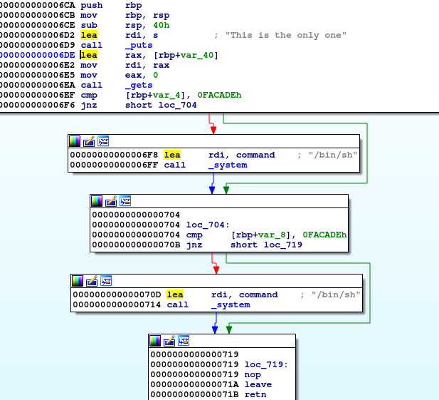

Not solved :(

# Try

`file`コマンドで形式を調べる。

```bash
$ file chall_00
chall_00: ELF 64-bit LSB shared object, x86-64, version 1 (SYSV), dynamically linked, interpreter /lib64/ld-linux-x86-64.so.2, for GNU/Linux 3.2.0, BuildID[sha1]=dadca72eeddf37ba3b9fed1543b8ccdf75cbc78e, not stripped
```

IDAを使って処理の流れを調べる。



`gets()`でバッファーオーバーフローの脆弱性をつき、`cmp`で`0FACADEh`に一致させる、もしくはシェルを奪取すれば良さそう。

# Solution