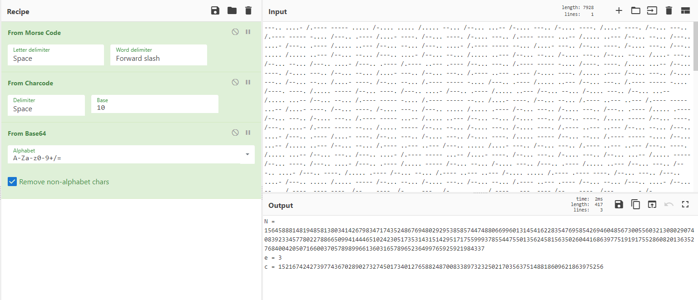
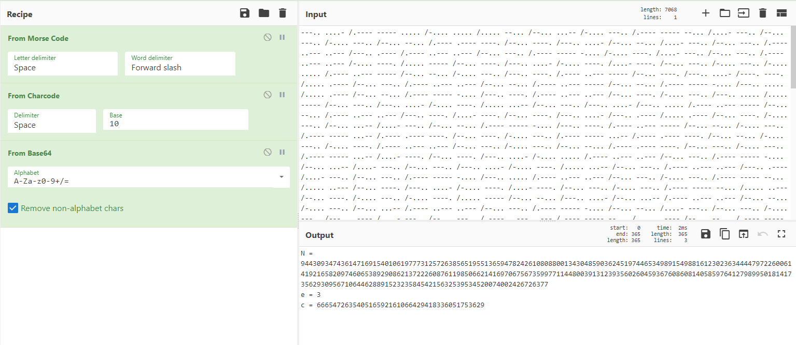

# Writeup

netcatを使ってみる。

```
$ nc crypto.chal.csaw.io 5001
Can you decrypt them all to prove yourself?

What does this mean?
---.. ....- /.---- ----- ..... /-.... ..... /..... --... /--... ...-- /-.... ---.. /-.... ----. /....- ----. /--... ---.. /.---- ----- -.... /---.. .---- /....- ----. /--... ----. /-.... ---.. /.---- ----- ...-- /..... ..--- /--... --... /---.. ....- /---.. .---- /..... ..--- /--... --... /---.. ....- /.---- ----- --... /....- ---.. /--... ----. /-.... ---.. /---.. ..... /..... ..--- /--... --... /---.. ....- /--... --... /..... ..--- /--... --... /-.... ---.. /--... --... /....- ---.. /--... --... /---.. ....- /---.. .---- /.---- ..--- .---- /--... ---.. /.---- ----- -.... /----. ----. /..... ...-- /--... ----. /-.... ---.. /--... --... /....- ---.. /--... ---.. /.---- ..--- ..--- /-.... ----. /..... .---- /--... ---.. /-.... ---.. /--... --... /....- ----. /--... --... /.---- ----- -.... /---.. .---- /..... ..--- /--... ---.. /.---- ----- -.... /----. ----. /..... ----- /--... ----. /---.. ....- /---.. .---- /..... ..--- /--... --... /-.... ---.. /--... ...-- /..... ...-- /--... --... /.---- ----- -.... /.---- ----- --... /....- ----. /--... --... /.---- ..--- ..--- /.---- ----- ...-- /....- ----. /--... ----. /-.... ---.. /---.. ..... /..... .---- /--... ---.. /-.... ---.. /---.. .---- /..... .---- /--... ---.. /-.... ---.. /.---- ----- ...-- /..... ..--- /--... --... /-.... ---.. /---.. ----. /..... ----- /--... ----. /---.. ....- /.---- ----- --... /..... ----- /--... --... /-.... ---.. /-.... ----. /.---- ..--- ..--- /--... --... /---.. ....- /---.. .---- /....- ----. /--... ---.. /-.... ---.. /-.... ----. /..... ----- /--... --... /.---- ----- -.... /--... ...-- /..... ..--- /--... --... /.---- ..--- ..--- /---.. ..... /....- ---.. /--... ---.. /.---- ..--- ..--- /---.. ----. /..... ...-- /--... ---.. /---.. ....- /.---- ----- ...-- /....- ----. /--... ---.. /-.... ---.. /--... ...-- /..... ----- /--... ----. /---.. ....- /---.. .---- /..... ----- /--... --... /-.... ---.. /---.. .---- /..... ..--- /--... ---.. /---.. ....- /---.. ----. /..... .---- /--... --... /.---- ..--- ..--- /-.... ..... /.---- .---- ----. /--... ---.. /---.. ....- /---.. ..... /..... ----- /--... --... /-.... ---.. /--... --... /.---- ..--- .---- /--... --... /---.. ....- /--... --... /.---- .---- ----. /--... ----. /-.... ---.. /-.... ..... /.---- ..--- .---- /--... ----. /---.. ....- /-.... ..... /..... .---- /--... ---.. /-.... ---.. /-.... ..... /..... ..--- /--... --... /.---- ..--- ..--- /.---- ----- --... /.---- ..--- .---- /--... --... /.---- ..--- ..--- /--... --... /....- ---.. /--... ---.. /---.. ....- /----. ----. /..... .---- /--... ----. /-.... ---.. /-.... ..... /.---- ..--- .---- /--... --... /.---- ----- -.... /----. ----. /..... ..--- /--... ----. /-.... ---.. /---.. ----. /..... ----- /--... ---.. /---.. ....- /-.... ..... /..... ...-- /--... ----. /---.. ....- /---.. .---- /.---- ..--- ----- /--... ---.. /-.... ---.. /---.. .---- /....- ---.. /--... ---.. /.---- ----- -.... /---.. ..... /.---- ..--- ----- /--... --... /-.... ---.. /--... ...-- /....- ---.. /--... --... /.---- ----- -.... /--... --... /.---- .---- ----. /--... ---.. /---.. ....- /-.... ----. /..... .---- /--... --... /.---- ..--- ..--- /---.. ..... /.---- ..--- ..--- /--... --... /---.. ....- /---.. .---- /.---- ..--- ..--- /--... --... /---.. ....- /---.. ..... /.---- ..--- ----- /--... ---.. /-.... ---.. /--... ...-- /..... ...-- /--... ---.. /---.. ....- /-.... ----. /..... .---- /--... --... /---.. ....- /----. ----. /....- ----. /--... ---.. /---.. ....- /.---- ----- --... /..... ...-- /--... ----. /---.. ....- /--... --... /..... .---- /--... ----. /-.... ---.. /---.. ..... /....- ----. /--... ---.. /-.... ---.. /---.. .---- /..... .---- /--... ---.. /---.. ....- /---.. ..... /.---- .---- ----. /--... --... /---.. ....- /--... --... /....- ----. /--... ---.. /.---- ----- -.... /--... ...-- /....- ---.. /--... ---.. /---.. ....- /.---- ----- ...-- /.---- ..--- ----- /--... ---.. /---.. ....- /---.. ----. /.---- ..--- ..--- /--... ---.. /---.. ....- /-.... ..... /.---- ..--- .---- /--... ---.. /.---- ----- -.... /-.... ..... /....- ---.. /--... ---.. /-.... ---.. /-.... ----. /..... ----- /--... ----. /-.... ---.. /---.. ----. /.---- ..--- ..--- /--... ----. /---.. ....- /----. ----. /..... .---- /--... ---.. /---.. ....- /-.... ----. /..... ...-- /--... --... /---.. ....- /.---- ----- --... /.---- ..--- ----- /--... ---.. /.---- ..--- ..--- /---.. ..... /....- ----. /--... --... /.---- ----- -.... /.---- ----- ...-- /..... ----- /--... --... /-.... ---.. /.---- ----- ...-- /.---- ..--- .---- /--... --... /-.... ---.. /-.... ----. /.---- ..--- ..--- /--... ---.. /.---- ----- -.... /--... --... /....- ----. /--... --... /.---- ----- -.... /----. ----. /..... ----- /--... ----. /-.... ---.. /---.. .---- /.---- .---- ----. /--... --... /-.... ---.. /---.. .---- /.---- ..--- .---- /--... --... /-.... ---.. /---.. ..... /.---- .---- ----. /--... ---.. /.---- ..--- ..--- /-.... ----. /..... ----- /--... ---.. /.---- ----- -.... /-.... ..... /.---- .---- ----. /--... --... /.---- ..--- ..--- /----. ----. /.---- .---- ----. /--... ---.. /---.. ....- /----. ----. /..... ..--- /--... ----. /---.. ....- /.---- ----- ...-- /..... ...-- /--... ----. /---.. ....- /---.. ----. /..... ----- /--... --... /---.. ....- /--... --... /..... ----- /--... --... /-.... ---.. /--... --... /.---- ..--- ----- /--... ---.. /.---- ----- -.... /---.. ..... /..... .---- /--... ----. /-.... ---.. /.---- ----- --... /..... ----- /--... ---.. /---.. ....- /--... ...-- /.---- ..--- ..--- /--... ---.. /.---- ----- -.... /---.. .---- /..... ...-- /--... ----. /---.. ....- /----. ----. /..... ----- /--... ---.. /---.. ....- /.---- ----- --... /.---- ..--- .---- /--... ---.. /---.. ....- /.---- ----- --... /.---- ..--- .---- /--... --... /---.. ....- /.---- ----- --... /..... ..--- /--... ---.. /-.... ---.. /--... --... /.---- ..--- ..--- /--... ---.. /.---- .---- ----. /.---- .---- ..--- /.---- ----- ---.. /--... ...-- /-.... ---.. /....- ---.. /.---- ----- ...-- /--... --... /.---- .---- ----. /.---- .---- ..--- /.---- ----- -.... /--... ...-- /-.... ---.. /....- ---.. /.---- ----- ...-- /--... --... /---.. ....- /---.. ..... /.---- ..--- .---- /--... --... /---.. ....- /---.. ----. /..... .---- /--... ---.. /-.... ---.. /--... ...-- /....- ---.. /--... --... /.---- ----- -.... /----. ----. /.---- ..--- ..--- /--... ----. /---.. ....- /----. ----. /..... .---- /--... ---.. /-.... ---.. /--... --... /..... ----- /--... ---.. /.---- ..--- ..--- /-.... ..... /.---- ..--- .---- /--... ----. /-.... ---.. /.---- ----- --... /.---- .---- ----. /--... --... /.---- ----- -.... /----. ----. /.---- ..--- ..--- /--... --... /.---- ----- -.... /----. ----. /....- ---.. /--... ---.. /---.. ....- /-.... ..... /.---- ..--- ----- /--... ---.. /.---- ..--- ..--- /--... --... /....- ---.. /--... --... /-.... ---.. /-.... ----. /.---- ..--- .---- /--... ---.. /.---- ..--- ..--- /---.. ----. /....- ----. /--... ----. /-.... ---.. /.---- ----- ...-- /.---- ..--- .---- /--... ---.. /-.... ---.. /.---- ----- ...-- /..... .---- /--... --... /-.... ---.. /-.... ..... /..... ..--- /--... --... /.---- ..--- ..--- /--... --... /..... ..--- /--... ----. /---.. ....- /----. ----. /.---- ..--- ..--- /--... --... /.---- ----- -.... /--... --... /.---- ..--- .---- /--... ---.. /---.. ....- /-.... ..... /.---- ..--- .---- /--... --... /---.. ....- /----. ----. /.---- .---- ----. /--... --... /.---- ..--- ..--- /---.. ..... /..... ----- /--... --... /.---- ..--- ..--- /----. ----. /....- ----. /--... --... /---.. ....- /---.. .---- /..... ..--- /--... ----. /-.... ---.. /-.... ----. /..... ..--- /--... ---.. /.---- ----- -.... /-.... ..... /..... ...-- /--... ---.. /.---- ----- -.... /--... ...-- /.---- ..--- ----- /--... ----. /-.... ---.. /---.. ----. /.---- ..--- ..--- /--... ----. /---.. ....- /----. ----. /....- ----. /--... --... /.---- ----- -.... /---.. ..... /..... -----
>>
```

モールス信号を解読し、Base64デコードしたところ次のような結果が得られた。



`e=3`なので3乗根を取る。

```py
# sage
from Crypto.Util.number import *

e = 3
c = 152167424273977436702890273274501734012765882487008338973232502170356375148818609621863975256

print(long_to_bytes(c^(1/e)))
```

`Cbxrzba Anzrf`という結果が得られる。これをROT13すると`Pokemon Names`となる。

入力すると、さらにモールス信号のメッセージが表示される。

```
>> Pokemon Names
You are correct!

What does this mean?
---.. ....- /.---- ----- ..... /-.... ..... /..... --... /--... ...-- /-.... ---.. /.---- ----- --... /....- ---.. /--... ---.. /-.... ---.. /--... --... /.---- .---- ----. /--... ----. /---.. ....- /--... --... /....- ---.. /--... ---.. /.---- ..--- ..--- /---.. .---- /.---- ..--- ..--- /--... ---.. /.---- ----- -.... /-.... ----. /....- ---.. /--... ---.. /.---- ..--- ..--- /-.... ----. /..... ----- /--... ----. /---.. ....- /-.... ----. /....- ----. /--... ---.. /-.... ---.. /-.... ..... /.---- ..--- ----- /--... --... /-.... ---.. /---.. ----. /.---- ..--- ----- /--... ----. /---.. ....- /----. ----. /..... .---- /--... ---.. /.---- ..--- ..--- /--... --... /.---- ..--- ----- /--... --... /.---- ----- -.... /---.. ..... /..... .---- /--... --... /.---- ----- -.... /---.. ----. /.---- ..--- ..--- /--... ----. /-.... ---.. /---.. ..... /..... ----- /--... ---.. /---.. ....- /-.... ----. /..... ...-- /--... ---.. /---.. ....- /---.. ..... /.---- ..--- ----- /--... --... /.---- ..--- ..--- /---.. ----. /....- ----. /--... ----. /---.. ....- /---.. .---- /..... .---- /--... ----. /-.... ---.. /--... ...-- /....- ---.. /--... --... /.---- ----- -.... /---.. ----. /.---- ..--- ----- /--... --... /-.... ---.. /.---- ----- ...-- /.---- .---- ----. /--... ----. /-.... ---.. /.---- ----- ...-- /.---- .---- ----. /--... --... /-.... ---.. /-.... ----. /.---- ..--- ..--- /--... ---.. /-.... ---.. /--... --... /.---- .---- ----. /--... ---.. /-.... ---.. /.---- ----- ...-- /....- ----. /--... ----. /---.. ....- /-.... ..... /.---- ..--- ..--- /--... ---.. /.---- ----- -.... /--... ...-- /....- ---.. /--... ---.. /---.. ....- /-.... ----. /..... ...-- /--... ---.. /.---- ..--- ..--- /---.. .---- /....- ---.. /--... ---.. /.---- ----- -.... /---.. ..... /.---- ..--- ..--- /--... ---.. /-.... ---.. /.---- ----- --... /..... ..--- /--... ----. /---.. ....- /-.... ----. /....- ----. /--... ---.. /-.... ---.. /.---- ----- --... /..... ..--- /--... ----. /-.... ---.. /-.... ----. /..... ----- /--... --... /---.. ....- /--... ...-- /.---- ..--- ..--- /--... --... /-.... ---.. /--... ...-- /.---- ..--- ..--- /--... ---.. /.---- ----- -.... /--... --... /....- ---.. /--... ---.. /-.... ---.. /---.. .---- /....- ---.. /--... ---.. /.---- ..--- ..--- /.---- ----- --... /..... .---- /--... --... /.---- ----- -.... /--... ...-- /..... ----- /--... --... /-.... ---.. /-.... ..... /..... ----- /--... --... /---.. ....- /---.. .---- /.---- ..--- ----- /--... ----. /---.. ....- /--... ...-- /.---- ..--- ----- /--... ---.. /.---- ----- -.... /---.. ..... /..... ..--- /--... --... /.---- ----- -.... /-.... ..... /..... ...-- /--... ---.. /.---- ..--- ..--- /---.. .---- /..... ----- /--... --... /-.... ---.. /---.. ----. /....- ----. /--... --... /.---- ..--- ..--- /.---- ----- ...-- /..... ...-- /--... --... /.---- ----- -.... /.---- ----- --... /.---- .---- ----. /--... ----. /-.... ---.. /---.. ----. /.---- ..--- .---- /--... --... /---.. ....- /--... --... /..... .---- /--... --... /.---- ----- -.... /--... ...-- /.---- ..--- .---- /--... ---.. /.---- ----- -.... /-.... ..... /..... ..--- /--... ---.. /.---- ..--- ..--- /---.. ----. /.---- ..--- ----- /--... --... /---.. ....- /.---- ----- --... /..... ..--- /--... ---.. /---.. ....- /-.... ..... /..... ----- /--... ---.. /.---- ----- -.... /--... ...-- /.---- ..--- ----- /--... ---.. /-.... ---.. /-.... ----. /..... ----- /--... ----. /---.. ....- /----. ----. /.---- .---- ----. /--... ---.. /.---- ----- -.... /----. ----. /....- ----. /--... ---.. /.---- ----- -.... /----. ----. /.---- ..--- ..--- /--... ---.. /---.. ....- /.---- ----- --... /..... ...-- /--... ---.. /.---- ..--- ..--- /----. ----. /.---- ..--- ----- /--... --... /---.. ....- /---.. .---- /....- ---.. /--... ----. /-.... ---.. /-.... ..... /.---- .---- ----. /--... --... /.---- ..--- ..--- /.---- ----- --... /.---- ..--- ----- /--... --... /.---- ..--- ..--- /-.... ----. /.---- ..--- .---- /--... --... /.---- ..--- ..--- /.---- ----- --... /.---- ..--- ..--- /--... ---.. /---.. ....- /---.. ----. /.---- .---- ----. /--... --... /.---- ----- -.... /---.. ----. /.---- .---- ----. /--... ---.. /-.... ---.. /---.. ..... /..... ...-- /--... --... /.---- ..--- ..--- /---.. ----. /..... .---- /--... ---.. /.---- ----- -.... /-.... ..... /..... ..--- /--... ---.. /.---- ----- -.... /-.... ..... /..... ..--- /--... --... /---.. ....- /---.. .---- /.---- .---- ----. /--... ---.. /---.. ....- /.---- ----- ...-- /....- ----. /--... ----. /---.. ....- /----. ----. /..... ----- /--... ---.. /-.... ---.. /-.... ----. /.---- ..--- .---- /--... ---.. /.---- ..--- ..--- /.---- ----- --... /..... ..--- /--... ----. /---.. ....- /.---- ----- --... /....- ----. /--... --... /-.... ---.. /-.... ----. /..... ..--- /--... --... /---.. ....- /---.. .---- /.---- ..--- ----- /--... ---.. /.---- ..--- ..--- /--... --... /....- ----. /--... ---.. /.---- ----- -.... /--... ...-- /..... ...-- /--... --... /.---- ..--- ..--- /-.... ..... /..... ...-- /--... ---.. /---.. ....- /---.. ----. /..... .---- /--... --... /---.. ....- /-.... ..... /..... ----- /--... ---.. /-.... ---.. /---.. .---- /..... ----- /--... --... /.---- ----- -.... /.---- ----- ...-- /..... ..--- /--... ----. /---.. ....- /-.... ----. /....- ----. /--... --... /.---- ----- -.... /--... --... /.---- ..--- .---- /--... --... /.---- ..--- ..--- /---.. ..... /..... ..--- /--... ---.. /-.... ---.. /---.. ..... /....- ---.. /--... --... /.---- ----- -.... /-.... ----. /....- ----. /--... ---.. /.---- ----- -.... /--... --... /.---- ..--- .---- /--... ---.. /---.. ....- /--... --... /..... ...-- /--... ---.. /---.. ....- /--... --... /....- ---.. /--... ---.. /---.. ....- /--... ...-- /.---- .---- ----. /--... --... /-.... ---.. /----. ----. /....- ---.. /--... --... /-.... ---.. /-.... ..... /.---- ..--- .---- /--... ---.. /-.... ---.. /--... ...-- /..... ----- /--... ---.. /.---- ..--- ..--- /--... ...-- /..... ----- /--... --... /.---- ..--- ..--- /----. ----. /..... .---- /-.... --... /.---- ----- ----. /---.. ..... /.---- ----- ...-- /---.. ----- /---.. ...-- /-.... ..... /.---- ..--- ..--- /-.... --... /.---- ----- ----. /--... --... /.---- ----- ...-- /---.. ----- /---.. ...-- /-.... ..... /..... ----- /--... ---.. /.---- ----- -.... /---.. ----. /....- ----. /--... ---.. /-.... ---.. /----. ----. /.---- ..--- .---- /--... ---.. /.---- ----- -.... /--... --... /....- ----. /--... ---.. /-.... ---.. /-.... ..... /....- ----. /--... --... /---.. ....- /---.. ----. /....- ----. /--... ----. /---.. ....- /--... ...-- /.---- ..--- ----- /--... ---.. /.---- ----- -.... /-.... ----. /.---- .---- ----. /--... ---.. /.---- ----- -.... /---.. ----. /....- ---.. /--... --... /.---- ----- -.... /.---- ----- --... /....- ---.. /--... --... /---.. ....- /.---- ----- ...-- /.---- ..--- ..--- /--... --... /.---- ..--- ..--- /---.. ----. /.---- .---- ----. /--... ---.. /---.. ....- /-.... ----. /..... .---- /--... ---.. /---.. ....- /--... --... /..... ----- /--... --... /.---- ----- -.... /.---- ----- --... /-.... .----
>>
```



しかし、毎回`c`の値が異なるので、手入力では時間切れで間に合わない。

以下のスクリプトを実行しフラグが得られた。

```py
# sage
import collections
from pwn import *
import base64
import codecs
from Crypto.Util.number import *

morsetab = collections.OrderedDict([
    ('-----', '0'),
    ('.----', '1'),
    ('..---', '2'),
    ('...--', '3'),
    ('....-', '4'),
    ('.....', '5'),
    ('-....', '6'),
    ('--...', '7'),
    ('---..', '8'),
    ('----.', '9'),
])

io = remote('crypto.chal.csaw.io', 5001)
for _ in range(6):
    io.recvuntil('mean?\r\n')
    morse_code = io.recvline().strip().decode('utf-8').split(' /')

    char = ''
    for mc in morse_code:
        char_code = ''
        for m in mc.split(' '):
            char_code += morsetab[m]
        char += chr(int(char_code))

    dec = base64.b64decode(char).decode('utf-8')
    e,c,N = 0,0,0
    exec(dec)
    dec = long_to_bytes(c^(1/e)).decode('utf-8')
    dec = codecs.decode(dec, 'rot13')
    print('send : ', dec)
    io.sendline(dec)

io.interactive()
```

```
$ sage solver.sage
[x] Opening connection to crypto.chal.csaw.io on port 5001
[x] Opening connection to crypto.chal.csaw.io on port 5001: Trying 18.219.16.227
[+] Opening connection to crypto.chal.csaw.io on port 5001: Done
send :  Pokemon Names
send :  Cascoon
send :  Meganium
send :  Skorupi
send :  Cosmog
send :  Archen
[*] Switching to interactive mode
>> You are correct!

Congrats! The GPS is activated and here's a message from your friends: flag{We're_ALrEadY_0N_0uR_waY_7HE_j0UrnEY_57aR75_70day!}

[*] Got EOF while reading in interactive
```

<!-- flag{We're_ALrEadY_0N_0uR_waY_7HE_j0UrnEY_57aR75_70day!} -->
