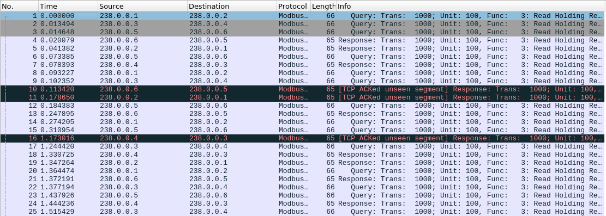

# Writeup

pcapファイルが与えられる。

Wiresharkで見てみると、プロトコルがModbusであることが分かった。



Responseの中身を調べると、UINT16の値をやり取りしていると分かったので、`flag{`というASCIIコードをやり取りしている部分を探した。

すると、`238.0.0.6` と `238.0.0.5` 間のやり取りだけ見れば良さそうだということが分かったので、抽出してみるとフラグが得られた。

```py
from scapy.all import *
import scapy.contrib.modbus as mb

pcap = rdpcap('modbus.pcap')
flag = ''
for pkt in pcap:
    src = pkt[IP].src
    if mb.ModbusADUResponse in pkt and src == '238.0.0.6':
        flag += chr(pkt[IP].registerVal[0])
print(flag)
```

<!-- flag{Ms_Fr1ZZL3_W0ULD_b3_s0_Pr0UD} -->
