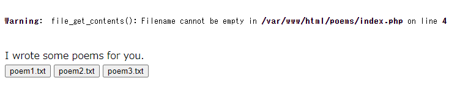

# Writeup

[http://web.chal.csaw.io:5003](http://web.chal.csaw.io:5003/) にアクセスする。

さらにリンク先の http://web.chal.csaw.io:5003/poems/ に飛ぶ。

`http://web.chal.csaw.io:5003/poems/?poem=poem1.txt` のように`poem`パラメータに指定したファイル名に対して`file_get_contents`が実行されて中身が表示される仕組みになっている。

`flag.txt`という名前でどこかのディレクトリにあるということなので、試しに http://web.chal.csaw.io:5003/poems/?poem=../flag.txt にアクセスしたところ、フラグが表示された。

<!-- flag{l0c4l_f1l3_1nclusi0n_f0r_7h3_w1n} -->
