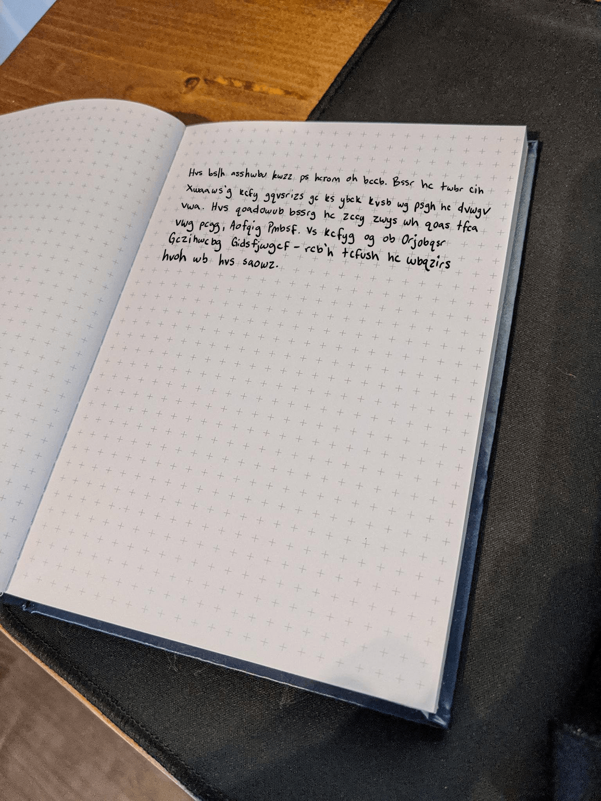

# Writeup

以下の画像が与えられる。



文章を書き起こすと以下のようになる。

```
Hvs bslh asshwbu kwzz ps hcrom og bccb. Bssr hr twbr cih
Xwaaws'g kcfy gqvsrizs gc ks ybck kvsb wg psgh hc dvwgv
vwa. Hvs qoadowvb bssrg hc zccy zwys wh qoas tfca
vwg pcgg, Aofqig Pmbsf. Bs kcfyg og ob Orjobqsr
Gczihwcbg Gidsfjwgcf - rcb'h tcfush hc wbqzirs
hvoh wb hvs saowz.
```

これをROT12すると

```
The next meeting will be today as noon. Need td find out
Jimmie's work schedule so we know when is best to phish
him. The campaihn needs to look like it came from
his boss, Marcus Byner. Ne works as an Advanced
Solutions Supervisor - don't forget to include
that in the email.
```

となるので、`Marcus Byner`がフラグになる。

<!-- flag{Marcus_Byner} -->

