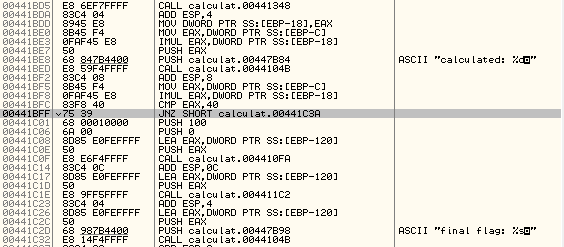

# Writeup

exeファイルが与えられるので実行してみる。

```powershell
> calculator.exe       
Please supply input files to calculate
```

Ghidraを使って、このメッセージを表示している部分を確認する。

```c
undefined8 __cdecl FUN_00411b60(int param_1,int param_2)

{
  int iVar1;
  undefined4 extraout_ECX;
  undefined4 extraout_EDX;
  undefined unaff_DI;
  undefined4 *puVar2;
  undefined8 uVar3;
  undefined uVar4;
  undefined in_stack_fffffe18;
  undefined local_124 [264];
  int local_1c;
  int local_10;
  uint local_8;
  
  iVar1 = 0x79;
  puVar2 = (undefined4 *)&stack0xfffffe18;
  while (iVar1 != 0) {
    iVar1 = iVar1 + -1;
    *puVar2 = 0xcccccccc;
    puVar2 = puVar2 + 1;
  }
  local_8 = DAT_0041a004 ^ (uint)&stack0xfffffffc;
  @__CheckForDebuggerJustMyCode@4(&DAT_0041c004);
  if (param_1 < 3) {
    uVar3 = thunk_FUN_00411cd0("Please supply input files to calculate\n",unaff_DI);
    uVar4 = (undefined)((ulonglong)uVar3 >> 0x20);
  }
  else {
    uVar3 = thunk_FUN_004117f0(*(char **)(param_2 + 4));
    local_10 = (int)uVar3;
    uVar3 = thunk_FUN_004117f0(*(char **)(param_2 + 8));
    local_1c = (int)uVar3;
    uVar3 = thunk_FUN_00411cd0("calculated: %d\n",(char)local_10 * (char)uVar3);
    uVar4 = (undefined)((ulonglong)uVar3 >> 0x20);
    if (local_10 * local_1c == 0x40) {
      memset(local_124,0,0x100);
      thunk_FUN_00411760((int)local_124);
      uVar3 = thunk_FUN_00411cd0("final flag: %s\n",0xdc);
      uVar4 = (undefined)((ulonglong)uVar3 >> 0x20);
    }
  }
  @_RTC_CheckStackVars@8((int)&stack0xfffffffc,(int *)&DAT_00411c6c);
  thunk_FUN_00411fc0(local_8 ^ (uint)&stack0xfffffffc,uVar4,in_stack_fffffe18);
  local_8 = 0x411c67;
  uVar3 = __RTC_CheckEsp(extraout_ECX,extraout_EDX);
  return uVar3;
}
```

この関数の呼び出し元を見ると`param_1`には引数の個数(exeを含む)が入っていたので、

```
  if (param_1 < 3) {
    uVar3 = thunk_FUN_00411cd0("Please supply input files to calculate\n",unaff_DI);
    uVar4 = (undefined)((ulonglong)uVar3 >> 0x20);
  }
```

を回避するために引数を適当に入力する。

```powershell
> calculator.exe 1 1
calculated: 0
```

あとは以下の部分を実行できれば良い。

```c
    if (local_10 * local_1c == 0x40) {
      memset(local_124,0,0x100);
      thunk_FUN_00411760((int)local_124);
      uVar3 = thunk_FUN_00411cd0("final flag: %s\n",0xdc);
      uVar4 = (undefined)((ulonglong)uVar3 >> 0x20);
    }
```

OllyDbgを用いて、if文に相当する`JNZ`命令を`NOP`に書き換えて実行する。




if文の中身が実行されて、フラグが表示された。


<!-- DawgCTF{c4LcU14T0r_64} -->
