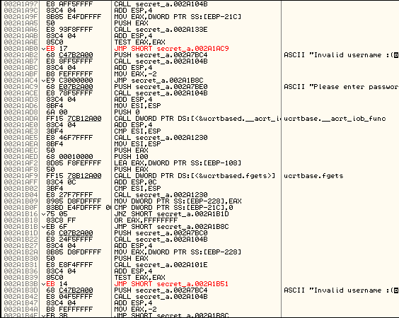

# Writeup

exeファイルが与えられるので実行してみる。

```powershell
> secret_app.exe
Hello and welcome to the secret app!
Please enter username > hoge

Invalid username :(
```

Ghidraで確認する。

```c
undefined8 FUN_004119d0(void)

{
  int iVar1;
  undefined4 extraout_ECX;
  undefined4 extraout_ECX_00;
  undefined4 extraout_ECX_01;
  undefined4 extraout_ECX_02;
  undefined4 extraout_ECX_03;
  undefined4 extraout_EDX;
  undefined4 extraout_EDX_00;
  undefined4 extraout_EDX_01;
  undefined4 extraout_EDX_02;
  undefined4 extraout_EDX_03;
  undefined unaff_DI;
  undefined4 *puVar2;
  undefined8 uVar3;
  ulonglong uVar4;
  ulonglong uVar5;
  undefined in_stack_fffffb48;
  undefined local_334 [264];
  char *local_22c;
  char *local_220;
  undefined local_214 [264];
  char local_10c [260];
  uint local_8;
  
  iVar1 = 0x12d;
  puVar2 = (undefined4 *)&stack0xfffffb48;
  while (iVar1 != 0) {
    iVar1 = iVar1 + -1;
    *puVar2 = 0xcccccccc;
    puVar2 = puVar2 + 1;
  }
  local_8 = DAT_0041a004 ^ (uint)&stack0xfffffffc;
  @__CheckForDebuggerJustMyCode@4(&DAT_0041c007);
  thunk_FUN_00411c90("Hello and welcome to the secret app!\n",unaff_DI);
  memset(local_10c,0,0x100);
  memset(local_214,0,0x100);
  thunk_FUN_00411c90("Please enter username > ",unaff_DI);
  __acrt_iob_func(0);
  uVar3 = __RTC_CheckEsp(extraout_ECX,extraout_EDX);
  fgets(local_10c,0x100,(FILE *)uVar3);
  uVar4 = __RTC_CheckEsp(extraout_ECX_00,extraout_EDX_00);
  local_220 = (char *)uVar4;
  if (local_220 != (char *)0x0) {
    thunk_FUN_00411c90(&DAT_00417bc0,unaff_DI);
    uVar3 = thunk_FUN_00411850(local_220);
    if ((int)uVar3 == 0) {
      uVar4 = thunk_FUN_00411c90("Invalid username :(\n",unaff_DI);
      uVar4 = uVar4 & 0xffffffff00000000 | ZEXT48(local_220);
    }
    else {
      thunk_FUN_00411c90("Please enter password > ",unaff_DI);
      __acrt_iob_func(0);
      uVar3 = __RTC_CheckEsp(extraout_ECX_01,extraout_EDX_01);
      fgets(local_10c,0x100,(FILE *)uVar3);
      uVar5 = __RTC_CheckEsp(extraout_ECX_02,extraout_EDX_02);
      uVar4 = uVar5 & 0xffffffff00000000 | ZEXT48(local_220);
      local_22c = (char *)uVar5;
      if (local_220 != (char *)0x0) {
        thunk_FUN_00411c90(&DAT_00417bc0,unaff_DI);
        uVar3 = thunk_FUN_004117d0(local_22c);
        if ((int)uVar3 == 0) {
          uVar4 = thunk_FUN_00411c90("Invalid username :(\n",unaff_DI);
          uVar4 = uVar4 & 0xffffffff00000000 | ZEXT48(local_220);
        }
        else {
          memset(local_334,0,0x100);
          thunk_FUN_00411740((int)local_334);
          uVar4 = thunk_FUN_00411c90("Flag is: %s",0xcc);
          uVar4 = uVar4 & 0xffffffff00000000 | ZEXT48(local_220);
        }
      }
    }
  }
  @_RTC_CheckStackVars@8((int)&stack0xfffffffc,(int *)&DAT_00411bbc);
  local_220 = (char *)uVar4;
  thunk_FUN_00411f80(local_8 ^ (uint)&stack0xfffffffc,(char)(uVar4 >> 0x20),in_stack_fffffb48);
  local_220 = (char *)uVar4;
  local_8 = 0x411bb7;
  uVar3 = __RTC_CheckEsp(extraout_ECX_03,extraout_EDX_03);
  return uVar3;
}
```

username と password に対し、Invalidとなるパスを回避すればよい。
```c
if ((int)uVar3 == 0) {
    uVar4 = thunk_FUN_00411c90("Invalid username :(\n",unaff_DI);
    uVar4 = uVar4 & 0xffffffff00000000 | ZEXT48(local_220);
}
else
{
    ...
}
```

OllyDbgでバイナリを書き換える。

ifの中に入ってしまう`JNZ`命令があるので、`JMP`に置き換えて実行するとelseの中が実行されてフラグが表示された。




<!-- DawgCTF{4pp_sup3r_53cret} -->
