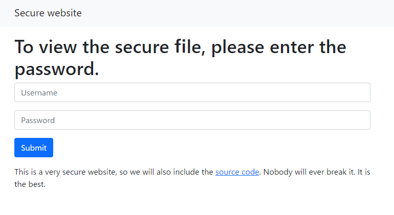

# Writeup

Username と Password を入力するフォームが表示される。



サーバーサイドのソースコードは以下のとおりである。

```php
<?php
    if (isset($_GET['username']) and isset($_GET['password'])) {
        if (hash("tiger128,4", $_GET['username']) != "51c3f5f5d8a8830bc5d8b7ebcb5717df") {
            echo "Invalid username";
        }
        else if (hash("tiger128,4", $_GET['password']) == "0e132798983807237937411964085731") {
            $flag = fopen("flag.txt", "r") or die("Cannot open file");
            echo fread($flag, filesize("flag.txt"));
            fclose($flag);
        }
        else {
            echo "Try harder";
        }
    }
    else {
        echo "Invalid parameters";
    }
?>
```

username と password は`tiger128,4`のハッシュ値であることが分かる。

ハッシュ値をそのままGoogleで検索すると、

`51c3f5f5d8a8830bc5d8b7ebcb5717df : admin`

であることが分かるが、password のほうは分からない。

hash と PHP について調べてみると、`0e`から始まるハッシュは浮動小数点型の`0`として扱われることが分かった。

* https://www.whitehatsec.com/blog/magic-hashes/

上記サイトのテーブルによると、`tiger128,4`で`479763000`のハッシュ値を求めると`00e05651056780370631793326323796`となるので、`479763000`をpasswordとして入力すればif文がtrueで評価される。

* http://dctf1-chall-very-secure-site.westeurope.azurecontainer.io/login.php?username=admin&password=479763000

<!-- dctf{It's_magic._I_ain't_gotta_explain_shit.} -->
