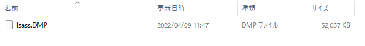

# Writeup

拡張子が DMP のファイルが与えられる。



```
$ file lsass/lsass.DMP 
lsass/lsass.DMP: Mini DuMP crash report, 16 streams, Sat Apr  9 02:47:27 2022, 0x421826 type
```

MiniDump というファイル形式であったので、次のURLを参考に Mimikatz を使ってパスワードを解析した。

https://blogs.tunelko.com/2018/10/01/cybercamp-2018-quals-friend-where-is-my-password/

```
mimikatz # sekurlsa::minidump C:\Users\Owner\Desktop\workspace\2022\DCTF_2022\Secure_Creds\lsass\lsass.DMP
Switch to MINIDUMP : 'C:\Users\Owner\Desktop\workspace\2022\DCTF_2022\Secure_Creds\lsass\lsass.DMP'

mimikatz # sekurlsa::logonPasswords
Opening : 'C:\Users\Owner\Desktop\workspace\2022\DCTF_2022\Secure_Creds\lsass\lsass.DMP' file for minidump...

Authentication Id : 0 ; 1093697 (00000000:0010b041)
Session           : Interactive from 2
User Name         : User
Domain            : WINDEV2108EVAL
Logon Server      : WINDEV2108EVAL
Logon Time        : 2022/04/09 11:46:33
SID               : S-1-5-21-3819158199-2843755626-3941670155-1001
        msv :
         [00000003] Primary
         * Username : User
         * Domain   : WINDEV2108EVAL
         * NTLM     : 5f667c317a4577700bd5cd84dcdc56e7
         * SHA1     : 2578b2405f6d6efa419c27dbe148e1fb942ea13a
        tspkg :
         * Username : User
         * Domain   : WINDEV2108EVAL
         * Password : dctf{n0_ant1v1ru5_l0l}
        wdigest :
         * Username : User
         * Domain   : WINDEV2108EVAL
         * Password : (null)
        kerberos :
         * Username : User
         * Domain   : WINDEV2108EVAL
         * Password : (null)
        ssp :
        credman :
        cloudap :       KO
```

<!-- dctf{n0_ant1v1ru5_l0l} -->
