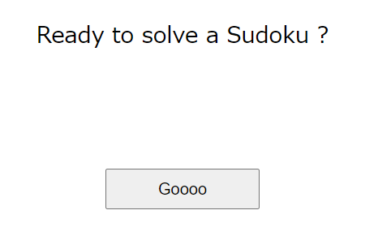
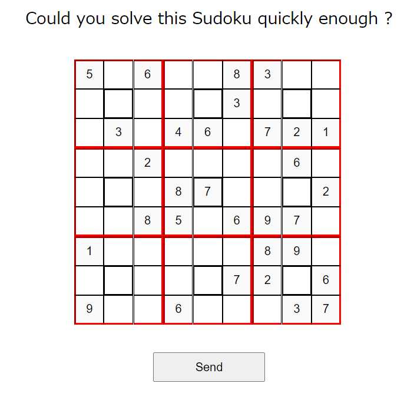
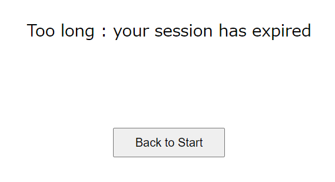

# Writeup

与えられたページにアクセスする。



数独が表示されるので解けば良さそう。



人力でやっても時間制限に引っ掛かるので、自動入力＆解答のプログラムを作成する。



数独のSolverは https://www.lifewithpython.com/2020/02/python-sudoku-solver.html を利用した。

数独を解いて、解答をPOSTするとフラグが得られた。

```py
import requests
from bs4 import BeautifulSoup
import sudoku

with requests.Session() as session:
    res = session.get("http://challs.dvc.tf:6002/home")
    bs = BeautifulSoup(res.text, 'html.parser')
    elem = bs.select("input[type='text']")
    assert len(elem) == 9*9
    sudoku_num = []
    for e in elem:
        if e.has_attr('value'):
            sudoku_num.append(int(e['value'][0]))
        else:
            sudoku_num.append(0)
    # split 9*9
    sudoku_num = [sudoku_num[i:i + 9] for i in range(0, len(sudoku_num), 9)]

    grid = sudoku.Grid(sudoku_num)
    results = sudoku.solve_all(grid)
    solve = results.pop()._values

    flat = lambda l : sum(l, [])

    post_value = {}
    for (a,b,c) in zip(flat(sudoku_num), flat(solve), range(len(flat(sudoku_num)))):
        if a == 0:
            post_value[f'{c+1}'] = f'{b}'

    res = session.post("http://challs.dvc.tf:6002/flag",data=post_value)
    print(res.text)
```

<!-- dvCTF{1l0v3toS0lV3sVd0kU} -->
