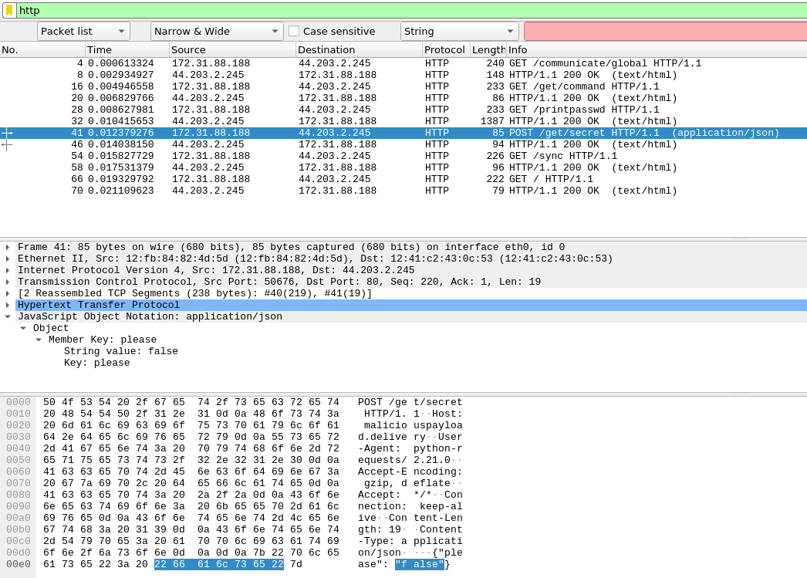

# Writeup

pcap ファイルが与えられる。中身を見ると HTTP のやりとりがあり、`/get/secret` に対して JSON を POST していた。



中身を `false` から `true` に変えて POST してみたところ、フラグ文字列が返ってきた。


```bash
$ curl -X POST http://maliciouspayload.delivery/get/secret -H "Content-Type: application/json" -d '{"please":"false"}'
sorry, you didn't say please%

$ curl -X POST http://maliciouspayload.delivery/get/secret -H "Content-Type: application/json" -d '{"please":"true"}'
RS{m4gic_word_is_4lw4ys_b31ng_p0lit3}%
```

<!-- RS{m4gic_word_is_4lw4ys_b31ng_p0lit3} -->
