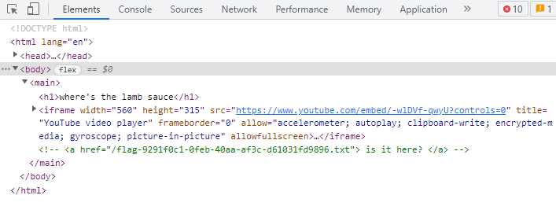

# Writeup

リンク先のWebページのソースを読むと、`a`タグがコメントアウトされていることが分かる。

* https://lamb-sauce.tjc.tf/flag-9291f0c1-0feb-40aa-af3c-d61031fd9896.txt

にアクセスするとフラグが表示された。

<!-- tjctf{idk_man_but_here's_a_flag_462c964f0a177541} -->
